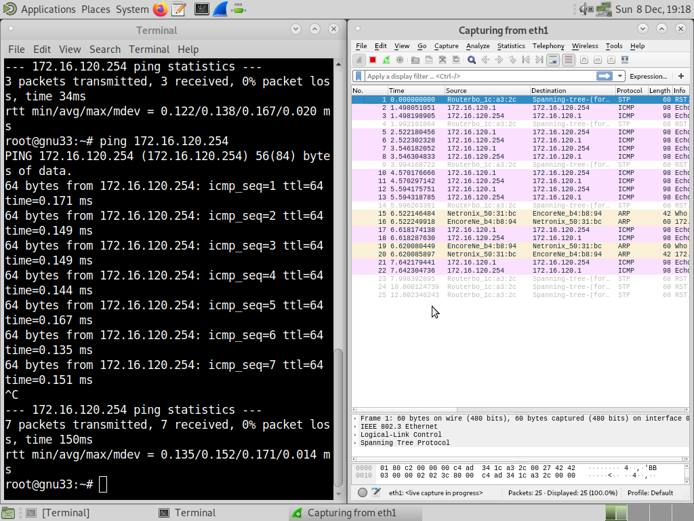
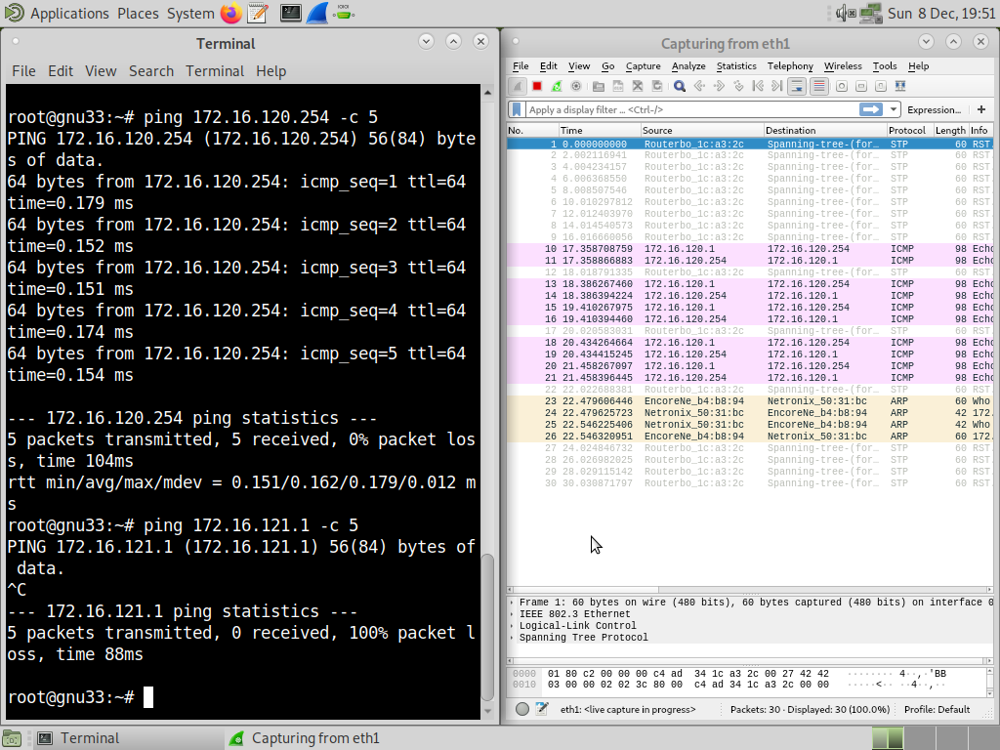
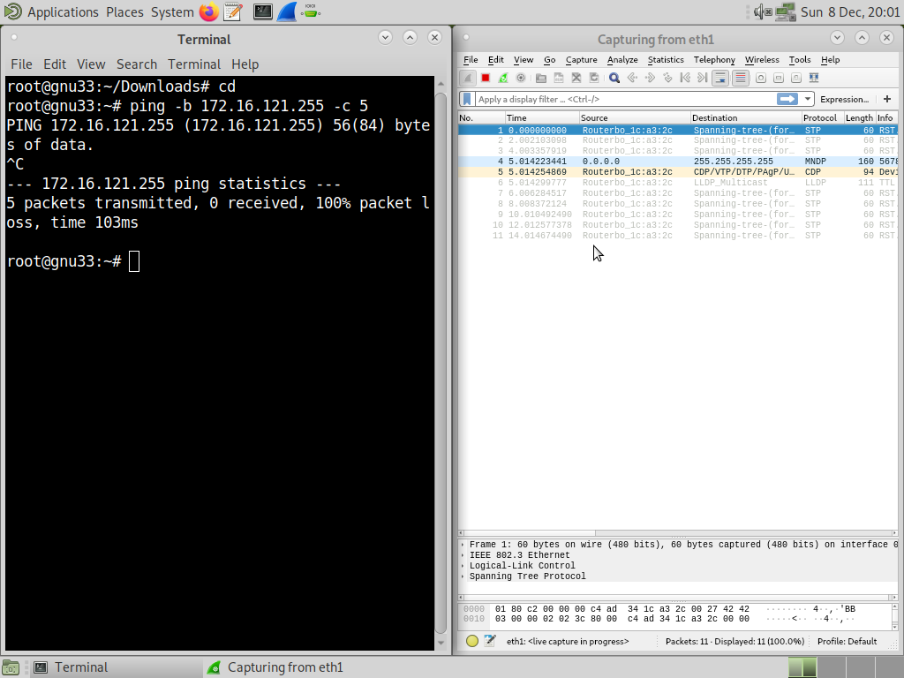

# Computer Networks

## Evaluation

### Organization
 - Groups of 2 students
### Evaluation criteria
 - Participation during class (continuous evaluation)
 - Presentation and demonstration of the work
 - Individual 15-minute quiz to be answered in the classroom, on the last
class before the presentation
 - Final report
### Demonstration of the work
 - Replicate the network topology described in Part 2 / Exp 6
 - Using different IP addresses for the Bridges (announced before the
demonstration starts)

## Part 1: Development of a download application

### Develop application download ftp://ftp.netlab.fe.up.pt/pub/...
 - Application downloads a single file
 - Implements FTP application protocol, as described in RFC959
 - Adopts URL syntax, as described in RFC1738
ftp://[<user>:<password>@]<host>/<url-path>
### Steps
 - Experiments using Telnet application (Telnet, SMTP, POP, HTTP and FTP); focus on FTP
 - Specification/design of a download application
     - unique use case: connect, login host, passive, get path, success (file saved in CWD) or un-success (indicating failing phase)
     - challenging programming aspects: gethostbyname, sockets, control connection, passive, data connection
 - Implement a very simple FTP client at home
     - reuse existing programs: clientTCP.c, getIP.c
### Learning objectives
 - Describe client - server concept and its peculiarities in TCP/IP
 - Characterize application protocols in general, characterize URL, describe in detail the behaviour of FTP
 - Locate and read RFCs
 - Implement a simple FTP client in C language
 - Use sockets and TCP in C language
 - Understand service provided DNS and use it within a client program

### RFC959

RFC959 stands for "Request for Comments 959," which is a document that specifies the File Transfer Protocol (FTP). FTP is a standard network protocol used to transfer files from one host to another over a TCP-based network, such as the Internet.

RFC959 was published in October 1985 and defines the commands and responses used in FTP, as well as the data structures and transmission modes. It provides a detailed description of how clients and servers should interact to ensure reliable and efficient file transfers. The protocol supports various features, including user authentication, directory navigation, and file manipulation commands.

Core Features:
Commands and Responses: Defines a set of standard commands (like USER, PASS, STOR, RETR, etc.) and response codes (e.g., 200, 331, 550) for interaction between clients and servers.
 - Authentication: Supports user credentials (username and password) for access control.
 - Directory Navigation: Allows clients to navigate, list, and manage directories on the server.
 - Data Transfer Modes: Supports multiple modes, including ASCII and binary file transfers, and can transfer data in streams or blocks.
 - Connection Architecture: Separates the control connection (for commands and responses) from the data connection (for file transfers), providing flexibility and performance.


### RFC1738

RFC1738 stands for "Request for Comments 1738," which is a document that specifies the Uniform Resource Locators (URL) syntax. A URL is a web address that identifies a resource on the Internet, such as a webpage, file, or directory.

Published in December 1994, RFC1738 defines the syntax and components of a URL, including the protocol, host, port, path, and query parameters. It provides guidelines for constructing valid URLs and describes how they are used to access resources on the web.

Core Features:
 - URL Components: Describes the structure of a URL, including the protocol (e.g., http, ftp), host (e.g., www.example.com), port (optional), path (e.g., /path/to/resource), and query parameters (e.g., ?key1=value1&key2=value2).
 - URL Encoding: Specifies rules for encoding special characters in URLs to ensure compatibility with web browsers and servers.
 - URL Schemes: Defines standard URL schemes (e.g., http, ftp, mailto) and their corresponding protocols for accessing resources.
 - URL Syntax: Provides examples and guidelines for constructing valid URLs, including relative and absolute URLs.
 - URL Resolution: Describes how URLs are resolved by web browsers and servers to locate and retrieve resources on the Internet.

### Telnet

Use Telnet to interact with an FTP server:

Connect:
```bash
telnet ftp.netlab.fe.up.pt 21
```
Log in:
```bash
USER anonymous
PASS your_email@example.com
```
Switch to passive mode:
```bash
PASV
```
Retrieve a file:
```bash
RETR pub/somefile.txt
```
Observe the server responses and how connections are managed.

## Making the protocol

### Key Goals for the FTP Client:

 - Parse the FTP URL to extract components such as user, password, host, resource path, and file name.
 - Establish a control connection using a socket to communicate with the FTP server.
 - Authenticate with the server using the provided username and password.
 - Switch to passive mode to determine the IP and port for the data connection.
 - Request the file and receive it over the data connection.
 - Save the file locally while maintaining error handling.

### Steps to Implement
1. URL Parsing (parse_url)

    Use sscanf or a similar method to extract user, password, host, and path components.
    Convert the host into an IP address using gethostbyname.

2. Socket Creation (create_socket)

    Use the socket() function to create a socket.
    Use connect() to establish a connection to the server.

3. Authentication (authenticate)

    Send FTP commands like USER <username> and PASS <password> using send() and recv().

4. Passive Mode (enter_passive_mode)

    Send the PASV command to the server.
    Parse the server's response to extract the IP address and port.

5. File Request (request_file)

    Send the RETR <file> command to the server.

6. File Download (download_file)

    Use the data connection to receive the file contents.
    Save the received data to a file.

7. Error Handling (handle_error)

    Implement meaningful error messages for each step to aid debugging.


## Part 2: Configuration and Study of a Computer Network

Y = number of the group

### Experiment 1: Configure IP Network

#### Steps

 - Connect E1 TUX3 and E1 TUX4 to the switch 
     - gnuY3E1 and gnuY4E1 to any port 3 and 4 on the switch (preferably 3 and 4)
 - Configure eth1interface of tuxY3 and eth1 interface of tuxY4 using ifconfig and route commands
     - ifconfig eth1 172.16.Y0.1/24 on tuxY3
     - ifconfig eth1 172.16.Y0.254/24 on tuxY4
 - Open Wireshark and ping from tuxY3 to tuxY4 (ping 172.16.Y0.254)
     

#### Questions

 1. What are the ARP packets and what are they used for?
     - ARP (Address Resolution Protocol) packets are used to map an IP address to a MAC address within a local network. When a device needs to send data to another device on the same network but only knows the IP address, it uses ARP to find out the corresponding MAC address.
 2. What are the MAC and IP addresses of ARP packets and why?
     - In an ARP request:
         - Source IP and MAC: The IP and MAC address of the requesting device (e.g., tuxY3 in the diagram).
         - Destination IP: The IP address of the target device (e.g., tuxY4), whose MAC address is unknown.
         - Destination MAC: Set to the broadcast address (FF:FF:FF:FF:FF:FF) because the ARP request is sent to all devices on the local network.
     - In an ARP reply:
         - Source MAC and IP: The MAC and IP of the responding device (e.g., tuxY4).
         - Destination MAC and IP: The MAC and IP of the requesting device (e.g., tuxY3).
 3. What packets does the ping command generate?
     - The ping command generates ICMP (Internet Control Message Protocol) packets, specifically:
         - ICMP Echo Request: Sent from the source to the destination.
         - ICMP Echo Reply: Sent back from the destination to the source.
 4. What are the MAC and IP addresses of the ping packets?
     - For a ping request:
         - Source MAC and IP: The MAC and IP of the sending device (e.g., tuxY3).
         - Destination MAC and IP: The MAC and IP of the target device (e.g., tuxY4).
     - For a ping reply:
         - Source MAC and IP: The MAC and IP of the responding device (e.g., tuxY4).
         - Destination MAC and IP: The MAC and IP of the device that initiated the ping (e.g., tuxY3).
 5. How to determine if a receiving Ethernet frame is ARP, IP, or ICMP?
     - By checking the EtherType field in the Ethernet frame header:
         - 0x0806: Indicates ARP.
         - 0x0800: Indicates IPv4 (for both IP and ICMP).
         - To distinguish ICMP, you must inspect the protocol field in the IP header, which will be 1 for ICMP.
 6. How to determine the length of a receiving frame?
    - The length of a frame can be determined by examining the Total Length field in the IP header (if it's an IP frame) or by inspecting the Ethernet frame size (including headers and payload). Tools like Wireshark or tcpdump can capture and display frame lengths.
7. What is the loopback interface and why is it important?
    - The loopback interface is a virtual network interface used for testing and self-communication within a device. It is commonly assigned the IP address 127.0.0.1 (or ::1 in IPv6).
    - Importance:
         - It allows applications on the same device to communicate without network hardware.
         - Useful for testing network configurations and software without requiring external network access.


### Experiment 2: Implement two bridges in a switch

#### Steps

 - Connect and configure E1 of tuxY2 and register its IP and MAC addresses
     - gnuY2E1 to port 2 on the switch and gnuY2S0 to cisco, as well as the console
     - ifconfig eth1 172.16.Y1.1/24
     - open GTKTerm and change the baud rate to 115200
         ```bash
         > admin
         > /system reset-configuration
         > y
         ```
 - Create bridgeY0 and bridgeY1
     - create the two bridges
     ```bash
     > /interface bridge add name=bridgeY0
     > /interface bridge add name=bridgeY1
     ```
     - remove the ports from the default bridge
     ```bash
     > /interface bridge port remove [find interface=ether3] 
     > /interface bridge port remove [find interface=ether4]
     > /interface bridge port remove [find interface=ether2]
    ```
     - add the ports to the bridges
     ```bash
     > /interface bridge port add bridge=bridgeY0 interface=ether3
     > /interface bridge port add bridge=bridgeY0 interface=ether4
     > /interface bridge port add bridge=bridgeY1 interface=ether2
     ```

 - Start the capture at tuxY3.eth1
     - ping from tuxY3 to tuxY4 and tuxY2
     
     

#### Questions

 1. How to configure bridge Y0?
     - To configure bridgeY0:
         - Create the bridge: `/interface bridge add name=bridgeY0`
         - Remove ports from the default bridge: `/interface bridge port remove [find interface=ether3]`
         - Add ports to bridgeY0: `/interface bridge port add bridge=bridgeY0 interface=ether3`
         - Repeat the above steps for the other port (ether4).
     - Explanation:
         - Creating a bridge: Establishes a Layer 2 (L2) bridge that connects multiple network segments (ports) to form a single broadcast domain.
         - Removing ports: Ensures that the ports are not part of the default bridge, preventing unwanted connectivity.
         - Adding ports: Associates the ports with bridgeY0, allowing devices connected to ether3 and ether4 to communicate directly.

 2. How many broadcast domains are there? How can you conclude it from the logs?
     - Answer: There are two broadcast domains:
         - One for the network 172.16.Y0.0/24 (contains tuxY3 and tuxY4 connected via bridgeY0).
         - One for the network 172.16.Y1.0/24 (contains tuxY2 connected via bridgeY1).
     - Reasoning: Each bridge (bridgeY0 and bridgeY1) creates a separate Layer 2 (L2) broadcast domain. Devices within the same bridge can communicate using broadcast packets, but broadcasts do not cross bridges unless routing is explicitly enabled.
     - Logs Analysis:
         - Broadcast packets (e.g., ARP) sent from tuxY3 should be visible on bridgeY0 logs but not on bridgeY1.
         - Similarly, broadcasts from tuxY2 will remain confined to bridgeY1.

### Experiment 3: Configure a Router in Linux

#### Steps

 - Make the tuxY4 a router
     - connect eth2 of tuxY4 to port 12 on the switch
     - configure eth2 of tuxY4
     ```bash
     ifconfig eth2 up
     ifconfig eth2 172.16.Y1.253/24
     ```
     - enable IP forwarding and disable ICMP
     ```bash
        echo 1 > /proc/sys/net/ipv4/ip_forward
        echo 0 > /proc/sys/net/ipv4/icmp_echo_ignore_broadcasts
     ```
 - Check MAC and IP addresses
     ```bash
        ifconfig eth2
     ```
 - Reconfigure the routes so that tuxY3 can reach tuxY2
     - tuxY2
     ```bash
        route add -net 172.16.Y0.0/24 gw 172.16.Y1.253
    ```
     - tuxY3
     ```bash
        route add -net 172.16.Y1.0/24 gw 172.16.Y0.254
     ```
 - Check Routes
     ```bash
        route -n
     ```
 - Start capture at tuxY3
     - ping from tuxY3
     ```bash
        ping 172.16.Y0.254
        ping 172.16.Y1.253
        ping 172.16.Y1.1
     ```
 - Start capture in tuxY4; use 2 instances of Wireshark, one per network interface
 - Clean the ARP tables in the 3 tuxes
 - In tuxY3, ping tuxY2 for a few seconds
     ```bash
        ping 172.16.Y1.1
     ```
 - Stop captures in tuxY4 and save logs

 #### Questions

 1. What routes are there in the tuxes? What are their meaning?
     - Each device (`tuxY3`, `tuxY4`, and `tuxY2`) will have routing tables that include:

         - **Local routes**: For the subnet the device is  directly connected to:
             - Example: On `tuxY3`, the route for `172.16.Y0.0/24` allows communication within the local subnet without involving a router.
         - **Default route**: To forward traffic to networks outside the local subnet:
             - Example: On `tuxY3`, the default route points to `tuxY4` at `172.16.Y0.254` (the gateway for the subnet).

     - Routing tables on each device:
     - **`tuxY3`**:
     ``` 
        Destination    Gateway         Interface
        172.16.Y0.0/24 Directly connected via eth0
        Default        172.16.Y0.254   eth0
     ```

     - **`tuxY4`** (router):
     ```
     Destination    Gateway         Interface
     172.16.Y0.0/24 Directly connected via eth0
     172.16.Y1.0/24 Directly connected via eth1
     Default        10.227.20.254   eth2
     ```

     - **`tuxY2`**:
     ```
     Destination    Gateway         Interface
     172.16.Y1.0/24 Directly connected via eth0
     Default        172.16.Y1.253   eth0
     ```

 2. What information does an entry of the forwarding table contain?
     - A forwarding table entry typically contains:
         - **Destination network**: The IP prefix (e.g., `172.16.Y0.0/24`).
         - **Gateway**: The next hop for reaching the destination.
         - **Interface**: The local interface used to forward packets (e.g., `eth0`).
         - **Metric**: (Optional) A value used to prioritize routes if multiple paths exist.
         - **Flags**: Indicators for route state (e.g., `U` for up, `G` for gateway).

 3. What ARP messages, and associated MAC addresses, are observed and why?**
     - **Observed ARP messages**:
         - **ARP Request**: Sent when a device wants to know the MAC address associated with a specific IP address.
         - Example: `tuxY3` sends an ARP request to find the MAC address of `172.16.Y0.254` (router `tuxY4`).
     - **ARP Reply**: Sent in response to an ARP request, containing the MAC address.
         - Example: `tuxY4` replies to `tuxY3` with its MAC address.

     - **Why?**
         - ARP is necessary to resolve IP addresses to MAC addresses for devices within the same subnet, as Ethernet uses MAC addresses to forward frames.

 4. What ICMP packets are observed and why?
     - **ICMP packets observed**:
         - **Echo Request (ICMP type 8)**: Sent by one device to another to test connectivity (e.g., when using the `ping` command).
         - **Echo Reply (ICMP type 0)**: Sent in response to an Echo Request.

     - **Why?**
         - ICMP is used for diagnostic and error-reporting purposes. For example, if `tuxY3` pings `tuxY2`, ICMP packets are exchanged between `tuxY3` and `tuxY2` via the router (`tuxY4`).

 5. What are the IP and MAC addresses associated with ICMP packets and why?
     - **IP addresses**:
         - **Source IP**: The IP address of the device initiating the ICMP packet.
         - **Destination IP**: The IP address of the target device.

     - **MAC addresses**:
         - On each hop:
             - **Source MAC**: The MAC address of the sending interface.
             - **Destination MAC**: The MAC address of the receiving interface.
         - Example: When `tuxY3` sends a ping to `tuxY2`:
             - **On `tuxY3` -> `tuxY4` link**:
                 - Source MAC: `tuxY3`'s MAC
                 - Destination MAC: `tuxY4`'s MAC
            - **On `tuxY4` -> `tuxY2` link**:
                 - Source MAC: `tuxY4`'s MAC
                 - Destination MAC: `tuxY2`'s MAC

    - **Why?**
     - MAC addresses change at each hop because Ethernet is a Layer 2 protocol, while IP remains unchanged since it operates at Layer 3.

### Experiment 4: Configure a Commercial Router and Implement NAT

#### Steps

 - Connect the eth1 of the router to the PY.12 port and eth2 to the switch, bridge Y1
     ```bash
        /ip address add address=172.16.1.Y9/24 interface=ether1
        /ip address add address=172.16.Y1.254/24 interface=ether2
    ```

#### Questions

### Experiment 5: DNS

#### Steps
 - Configure DNS at tuxY3, tuxY4, tuxY2 (use DNS server services.netlab.fe.up.pt (10.227.20.3))
 - Verify if names can be used in these hosts (e.g., ping hostname, use browser)
 - Execute ping (new-hostname-in-the-Internet); observe DNS related packets in Wireshark

#### Questions
» How to configure the DNS service in a host?
» What packets are exchanged by DNS and what information is transported

### Experiment 6: TCP connections


## Theory

### TCP/IP

 - IP (Internet Protocol) is implemented on all computers (hosts) and routers
 - Each computer has a unique IP address on each subnet it belongs to
 - Each process on a computer has a unique address (port)

### Demultiplexing

#### TCP/UDP header (port)
 - FTP → 21
 - Telnet → 23

#### IP header (protocol)
 - ICMP → 1
 - IGMP → 2
 - TCP → 6
 - UDP → 17
#### Ethernet header (type)
 - IP → 0x0800
 - ARP → 0x0806

#### IP Address

 - 32 bits
 - Network address
 - Host address
 - Subnet mask
 - Broadcast address

#### TCP

 - RFC 793
 - Characteristics
     - Ensures reliable end-to-end octet flow over unreliable support
     - Connection oriented protocol
     - Full-duplex connections
     - Positive Acknowledgment (ACK)
     - Recovers from losses and errors(retransmissions) after time-out
     - Orderly delivery of data to the application
     - Flow and congestion control
     - Multiplexing multiple TCP connections over the same IP address
 - TCP connection establishment
     - 3-way handshake
     - Client-server model

 - Source Port: port of origin
 - Destination Port: port of destination
 - Sequence Number: identifies, in the sender stream, the sequence of octets sent
 - Acknowledgement Number: corresponds to the octet number expected to receive
 - HLEN: the length of the TCP header (in 32-bit words)
 - URG: informs whether the Urgent Pointer field should be interpreted
 - ACK: informs whether the Ack number field is valid
 - PSH: allows to disable buffering
 - RST: used to reset a connection
 - SYN: allows to establish a connection
 - FIN: allows to close a connection